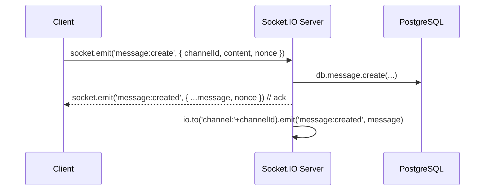

# Architecture — Nicecord

## Vue d'ensemble globale

```
                    ┌────────────────────────────────────┐
                    │             Navigateur             │
  ┌──────────┐      │              (React)               │
  │ Éditeur  │◀────▶│  Frontend: Next.js + Tailwind      │
  └──────────┘      │                                    │
                    ├─────────────── Socket.IO ───────────┤
                    │              WebSocket              │
                    │                                    │
  ┌──────────┐      │  Backend: Node.js / Express        │
  │ Éditeur  │◀────▶│  Socket.IO server                  │
  └──────────┘      │  REST API                            │
                    │                                    │
                    │  PostgreSQL ◀─ Prisma ORM           │
                    │  Redis    ◀─ rate-limit + presence │
                    └────────────────────────────────────┘
```

## Principe directeur : **contrat de types partagé**
Le package `packages/types` est la source unique de vérité pour tous les types
échangés entre le frontend et le backend. Aucun type Socket.IO n'est défini
localement — il provient toujours de `@nicecord/types`.

## Agents et responsabilités

| Agent | Domaine | Fichiers concernés |
|-------|---------|--------------------|
| Architecte/Superviseur | Architecture, planification | `/docs/architecture.md`, `/docs/api-contracts/` |
| Dev Front-end | UI, état client | `/apps/frontend/` |
| Dev Back-end | API, Socket.IO, DB | `/apps/backend/` |

## Décisions technologiques (ADRs)

### ADR-001 : Socket.IO v4
- **Pour** :_rooms par salon, middleware d'auth intégré, reconnexion automatique
- **Contre** : overhead légèrement plus élevé que pur WebSocket
- **Décision** : adopté — la productivité et le scaling via Redis adapter l'emportent

### ADR-002 : Monorepo npm workspaces
- Turborepo comme orchestrateur de builds
- `@nicecord/types` partagé
- Aucun duende (pas de micro-services)

### ADR-003 : Optimistic UI
- Le frontend affiche un message localement (via nonce) avant l'accusé serveur
- Le serveur émet `message:created` avec le même nonce → le front remplace l'optimistic

## Diagramme de flux temps réel (message)



## Roadmap

- **Sprint 1** : Auth (JWT/OAuth), guilde + channels list
- **Sprint 2** : Chat texte en temps réel (Socket.IO)
- **Sprint 3** : Voice channels (WebRTC)
- **Sprint 4** : Friends / presence / DMs
- **Sprint 5** : Modération, rôles, permissions
